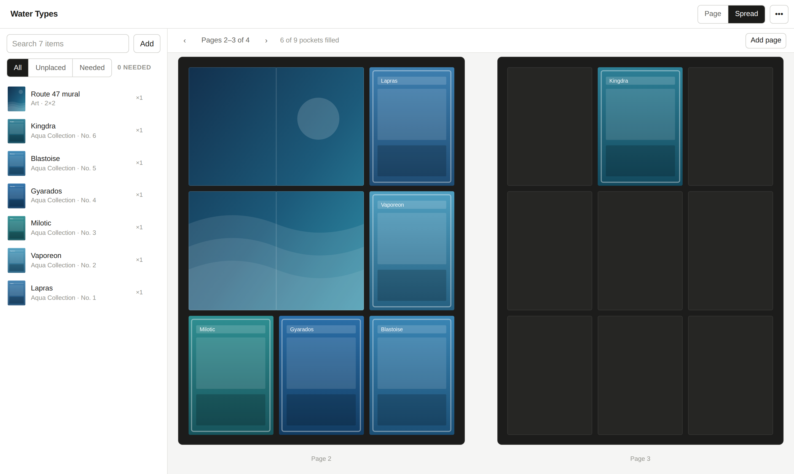

# Binder Studio

Plan a trading-card binder before you sleeve anything. Pick the pocket layout,
build a library of cards, and put each one in an exact pocket on an exact page —
including fan art and photos that span two or more pockets.



## Features

- **Any layout.** 2×2, 3×3, 4×3, 4×4 or a custom grid up to 8×8. Pockets keep a
  real card's proportions at every size.
- **Card library.** Search [pokemontcg.io](https://pokemontcg.io) by name, number
  or set, upload scans and photos, or add an image by URL.
- **Exact placement.** Pick a card and tap the pocket you want. On a desktop you
  can drag instead, and drop one card onto another to swap them.
- **Multi-pocket art.** Give a photo or piece of art a footprint — 2 wide, 2 tall,
  2×2, up to a whole page — and it lays out across those pockets exactly as the
  binder will show it, dividers and all. Art can also run across the spine onto
  the facing page.
- **Card library from a CSV.** Import an export from Deckbox, TCGplayer, Collectr
  or a spreadsheet; the columns are detected for you and images are looked up by
  name, set and number.
- **Cards you don't own yet.** Mark an item as needed and it sits in its pocket as
  a ghost, so a master-set binder shows its holes. Export the needed cards as a
  want list.
- **Binder view.** One page at a time, or a left/right spread. A binder opens on
  its front page alone on the right, which is also what decides whether a page is
  a left-hand or right-hand one — and so which of its pockets face each other.
- **Pages.** Insert, clear, delete, or fill a page with whatever is still unplaced.
- **Print to size.** Sheets of tiles at true physical size — 63 × 88 mm by
  default — with dashed cut lines and a label telling you which pocket each piece
  goes in. Art that spans pockets is sliced into one piece per pocket.
- **Export.** Render the current view to PNG, or save the binder as a file you can
  reopen later.

Built for phones first: the library is a bottom sheet, every control is a real
tap target, and placement never depends on dragging. Light and dark themes follow
your system setting.

Everything stays on your device — the layout in `localStorage`, images in
IndexedDB. No account, no server.

## Running it

```bash
npm install
npm run dev      # http://localhost:5173
```

```bash
npm run build    # static bundle in dist/
npm run preview  # serve the built bundle
```

Node 20+. The build output is static, so any file host will serve it.

## Printing to size

**Binder menu → Print sheets.** A pocket holds one piece of paper, so art
covering four pockets normally prints as four separate pieces, each exactly one
card in size. Every piece is labelled with the pocket it belongs in
(`P1 · C2 R1`), and they come out in the order you would fill the binder.

**Tell it how your pages are built.** Pockets load from the side, never the top
or bottom. On a 3×3 page the openings usually run → → ← along a right-hand page,
so the last two pockets of each row open towards each other with no divider
between them — one piece of art covers that pair uncut. Set the arrows in Binder
menu → _Pocket openings_ (or the Pockets section of the print dialog) to match
your binder.

A left-hand page is the back of the same sheet, so its welds sit in the same
physical places and its pattern is the mirror: → ← ←, pairing the _first_ two
pockets of each row. The app derives that for you, which is why the same piece of
art can be uncut on one page and cut on the facing one.

Everything else is one piece per pocket: welded seams, the spine, and any two
pockets stacked on top of each other — a vertical span is always cut, because no
pocket opens at its top or bottom edge.

**Measure your binder.** The _Divider_ field is the strip between two pockets on
a page, usually 3–5 mm; _Spine_ is the gap across the middle when the binder lies
open. Art laid across a divider is positioned across the whole span, dividers
included, and the strip that sits behind one is simply not printed — so a horizon
runs straight across the seam instead of jumping. Set the divider to `0` to slice
into equal pieces instead, keeping every pixel but shifting the halves apart.
These measurements also shape the pages on screen, so the plan is a scale drawing
of the real thing.

**Cutting.** Every piece gets a dashed line around it, and lines run the length
of the sheet and a few millimetres past the outermost pieces, so you can lay a
ruler along one and cut a whole row in a single pass. Lines never cross a piece,
so a two-pocket piece stays whole. Cut on every line: the thin strips between
pieces are waste, and cutting both sides of each piece means a wandering cut can
never eat into the one next to it.

**When you print:** choose _Scale 100%_ (not "Fit to page") and _Margins: None_.
Every sheet carries a 50 mm ruler — measure it once with a real ruler and you
know your printer is honest. Sheets are US Letter or A4, and card size can be
standard 63 × 88 mm, Japanese 59 × 86 mm, or anything you type.

The panel shows the resolution each image lands at once printed. Below roughly
180 dpi a photo starts to look soft at card size; 300 dpi is comfortable.

By default only your own images and art are selected — cards you found through
search are already in your hands, and cards marked as needed are not yet.

## Importing a collection

**Add → CSV** takes an export from Deckbox, TCGplayer, Collectr, Dragon Shield or
a plain spreadsheet. Paste the rows or pick the file; the header is matched
against the usual column names and you can correct the mapping by hand. Names are
then looked up in batches on pokemontcg.io and narrowed by set and card number,
so most rows arrive with the right artwork. Rows that match nothing still come in
by name, ready to place.

A row with a quantity of `0`, or the whole file if you tick _this is a want
list_, arrives marked as needed.

## Cards you don't own yet

Mark any item as **needed** in the library and every pocket holding it shows a
ghost: the art at a quarter strength with a small tag. A master-set binder can
then be laid out in full, holes and all. **Export want list** in the binder menu
writes the needed cards to a CSV you can take shopping.

## How it fits together

| Path                     | What lives there                                             |
| ------------------------ | ------------------------------------------------------------ |
| `src/store.tsx`          | Binder state, the reducer that owns every edit, persistence  |
| `src/types.ts`           | `Binder`, `LibraryItem`, `Placement`                         |
| `src/lib/geometry.ts`    | Grid maths: page proportions, bounds, overlap, drop validity |
| `src/lib/idb.ts`         | IndexedDB blob store for uploaded images                     |
| `src/lib/dnd.ts`         | Drag payload shared by the library and the pages             |
| `src/lib/exportImage.ts` | Canvas renderer behind Export PNG                            |
| `src/lib/transfer.ts`    | Save/open `.binder.json`, with images inlined                |
| `src/components/`        | Setup, top bar, library panel, page view, inspector          |

A **library item** is a card or piece of art you own. A **placement** is one copy
of it sitting at a page, column and row with a footprint in pockets. The same
card can be placed more than once; removing a library item removes its
placements too.

### Keyboard

| Key      | Action                                      |
| -------- | ------------------------------------------- |
| `←` `→`  | Previous / next page                        |
| `Delete` | Remove the selected item from the page      |
| `Esc`    | Cancel placing, close the library, deselect |

## Notes

- Card data and images come from the community
  [Pokémon TCG API](https://pokemontcg.io). A key is optional and only raises the
  rate limit; if you add one it is stored in your browser alone.
- PNG export asks image hosts for CORS permission. Uploaded images always export;
  a remote image whose host refuses is left as an empty pocket.
- The screenshot above uses placeholder artwork.
- Pokémon and Pokémon TCG are trademarks of Nintendo / Creatures Inc. /
  GAME FREAK inc. This is an unofficial fan tool.
